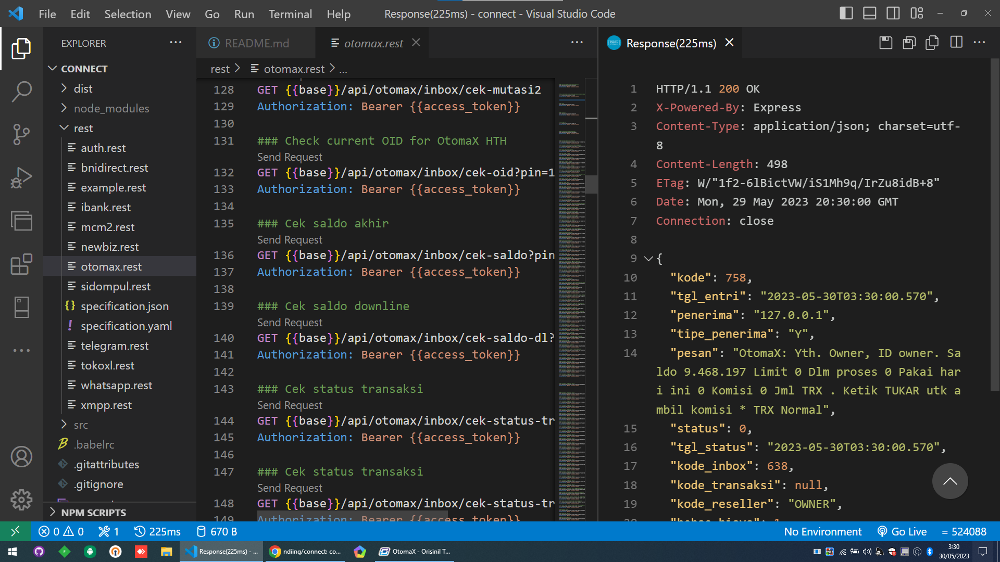

# Connect

[](https://github.com/ndiing/connect.git)

## Prasyarat

Proyek ini membutuhkan **[Node](https://nodejs.org/dist/v18.16.0/node-v18.16.0-x64.msi)** (versi **18** atau lebih baru) dan **NPM**.
**[Node](https://nodejs.org/dist/v18.16.0/node-v18.16.0-x64.msi)** dan **NPM** sangat mudah dipasang.Untuk memastikan Anda memilikinya tersedia di mesin Anda,
Coba jalankan perintah berikut.

```bash
npm -v && node -v
8.17.0
v18.16.0
```

## Instalasi

**SEBELUM ANDA MENGINSTAL**: silakan baca **[Prasyarat](#prasyarat)**

Mulailah dengan mengkloning repo ini di mesin lokal Anda:

```bash
git clone https://github.com/ndiing/connect.git
cd connect
```

<!--
Untuk menginstal, jalankan:

```bash
npm install
``` -->

## Penggunaan

### Memulai aplikasi

```bash
node dist/index.js
```

### Memperbarui aplikasi

```bash
git pull
```

## Folder

-   Data `%LOCALAPPDATA%/connect-data`
-   Konfigurasi `%LOCALAPPDATA%/connect-data/config/config.json`
-   Akses `%LOCALAPPDATA%/connect-data/auth/permission.json`

## REST

[Dokumentasi](https://ndiing.gitbook.io/connect/) API

### OtomaX

-   [x] **[auth](./rest/auth.rest)**
-   [x] **[otomax](./rest/otomax.rest)**

### Bank

-   [x] **[bnidirect](./rest/bnidirect.rest)**
-   [x] **[ibank](./rest/ibank.rest)**
-   [x] **[newbiz](./rest/newbiz.rest)**
-   [x] **[mcm2](./rest/mcm2.rest)**
-   [ ] **[klikbca](./rest/klikbca.rest)**

### Messenger

-   [x] **[whatsapp](./rest/whatsapp.rest)**
-   [x] **[telegram](./rest/telegram.rest)**
-   [x] **[xmpp](./rest/xmpp.rest)**

### Provider

-   [x] **[sidompul](./rest/sidompul.rest)**
-   [x] **[tokoxl](./rest/tokoxl.rest)**
-   [ ] **[linkita](./rest/linkita.rest)**
-   [ ] **[kiosgamer](./rest/kiosgamer.rest)**
